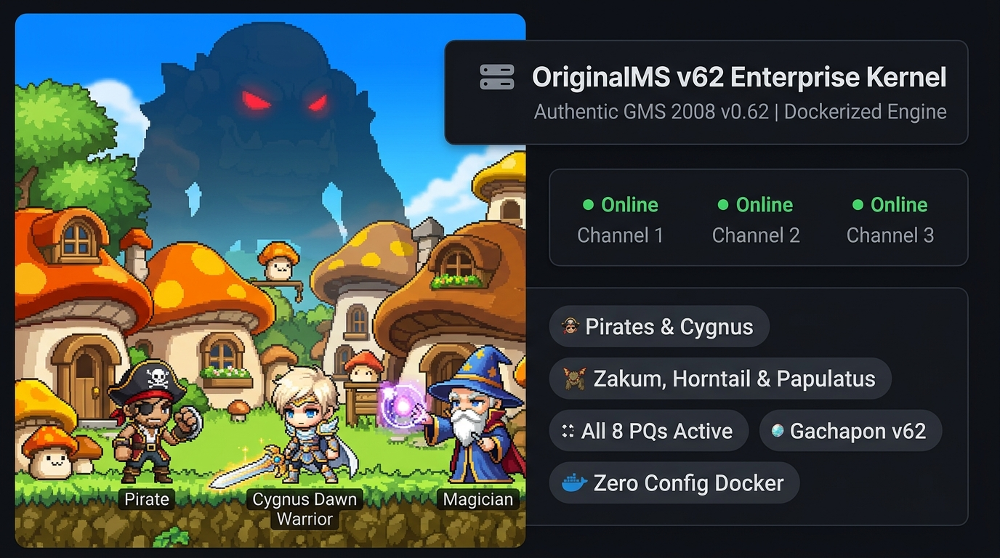
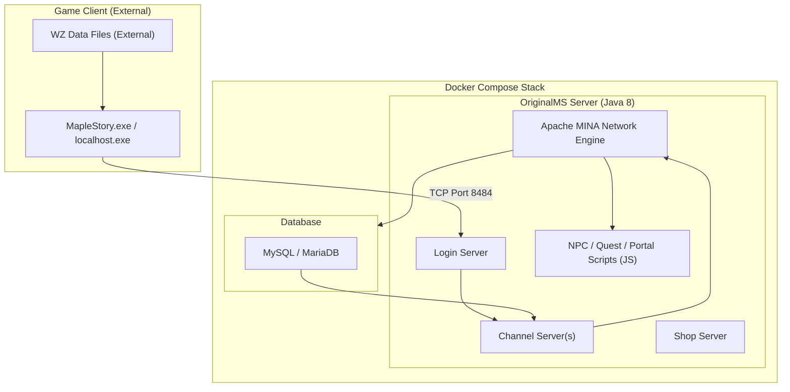
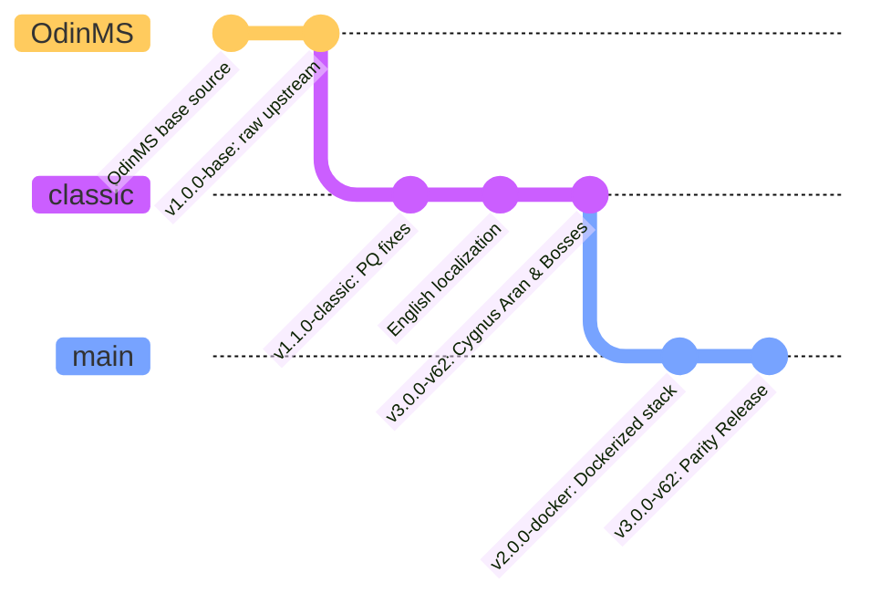

<div align="center">
  
</div>

<p align="center">
  <a href="https://skillicons.dev">
    
  </a>
</p>

<p align="center">
  
  
  
  
</p>

<p align="center">
  <strong>🌐 Part of the <a href="https://bios-system.net">BiosSystem Suite</a></strong>
</p>

**OriginalMS** is a modern, Dockerized classic MapleStory v62 (GMS 2008) server emulator. It ships with all Party Quests working, Cygnus Knights, Aran, bosses, and a fully localized English UI. Zero local environment setup required.

<p align="center">
  
</p>


## 🏗️ Architecture



## 🌿 Branch Structure

This project uses a strict 3-branch architecture:



| Branch | Version | Purpose |
|:---|:---|:---|
| **`main`** | `v3.0.0-v62` | Production-ready Docker deployment stack. Start here. |
| **`classic`** | `v3.0.0-v62` | All PQ fixes, boss phase gates, Cygnus/Aran jobs, and English localization applied. |
| **`OdinMS`** | `v1.0.0-base` | Raw upstream source, unmodified base. |

## ✅ What's Fixed in `classic` and `main`

- All Party Quests (Kerning PQ, Ludibrium PQ, Orbis PQ, Monster Carnival PQ, Amoria PQ, Pirate PQ) work end-to-end
- Cygnus Knights (Noblesse, Dawn Warrior, Blaze Wizard, Wind Archer, Night Walker, Thunder Breaker) and Aran class job enum registration and 5-byte packet decoding
- Complete boss suites for Zakum, Horntail, and Papulatus with server-side phase enforcement
- Authentic GMS v62 Gachapon tables rebuilt across all 12 game locations
- Complete Nautilus Harbor NPC coverage and English localization scrub across NPC scripts
- Exploits and dupe bugs from base OdinMS patched

## 🛠️ Technologies

| Layer | Technology |
|---|---|
| **Game Server** | Java 8 (J2SE), Apache MINA |
| **Database** | MySQL / MariaDB |
| **Scripting** | JavaScript (NPC / Portal / Quest logic) |
| **Containerization** | Docker, Docker Compose |
| **Build** | Maven |

## ⚠️ Required Files (Not Included)

To comply with licensing rules, three items must be sourced separately:

| Item | Where to Get It | Where to Place It |
|---|---|---|
| **WZ Data Files** | Extract from a v62 MapleStory client | `wz/` folder in project root |
| **Compiled JAR** | Build from source with Maven | Generated at `target/` |
| **Game Client** | A v62 MapleStory client patched for `localhost` | On the player's machine |

## 🚀 Quick Start

**Step 1.** Clone the `main` branch (Docker deployment):
```bash
git clone --branch main https://github.com/BiosSystem/OriginalMS.git
cd OriginalMS
```

**Step 2.** Place your WZ data files:
```bash
# Copy your extracted WZ folder into the project root
cp -r /path/to/your/wz ./wz
```

**Step 3.** Build the Java server:
```bash
mvn clean package -DskipTests
```

**Step 4.** Start the full stack with Docker Compose:
```bash
docker compose up -d
```

This starts the MySQL database and the OriginalMS server together. The server is ready when you see `Listening on port 8484` in the logs.

**Step 5.** Connect your game client:

Point your v62 `localhost.exe` at `127.0.0.1:8484` and log in with the default admin account (`admin` / `admin`).

**Step 6.** Check server logs:
```bash
docker compose logs -f originalms
```

## 🧩 Classic Branch Setup (No Docker)

If you prefer to run without Docker, use the `classic` branch and set up MySQL manually:

```bash
git clone --branch classic https://github.com/BiosSystem/OriginalMS.git
cd OriginalMS

# Import the database schema
mysql -u root -p < sql/install.sql

# Edit config
nano launch/config.properties  # set DB host, user, password

# Build and run
mvn clean package -DskipTests
java -jar target/OriginalMS.jar
```

## 📖 Documentation & Guides

- 🚀 **[Quick Start Guide](docs/wiki/Quick-Start-Guide.md)** - Step-by-step installation and client connection
- 🎮 **[GM Commands Reference](docs/wiki/GM-Commands.md)** - Full reference for player and GM commands
- 🐉 **[Boss Guides](docs/wiki/Boss-Guides.md)** - Zakum, Horntail, and Papulatus mechanics and entry requirements
- 🧩 **[Party Quest Guide](docs/wiki/Party-Quest-Guide.md)** - Level ranges, entry NPCs, and rewards for all active PQs
- 🛠️ **[Troubleshooting Guide](docs/wiki/Troubleshooting.md)** - Common setup issues, network fixes, and DB notes
- 🏠 **[Wiki Index](docs/wiki/Home.md)** - Complete documentation sitemap

<div align="center">
  <i>Maintained by the BiosSystem team.</i>
</div>
