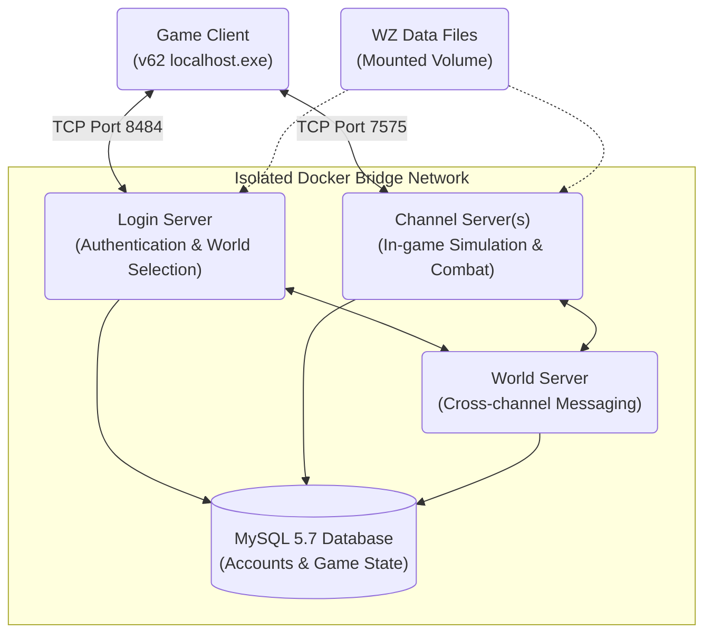

<div align="center">
  <h1>OriginalMS</h1>
  <p><strong>MapleStory v62 Emulator • Dockerized for 2026 • BiosSystem Kernel</strong></p>
</div>

<p align="center">
  A modern, containerized approach to classic MapleStory (GMS 2008). Experience the nostalgic journey with enterprise-grade stability, automated deployment, and comprehensive bug fixes.
</p>

## System Architecture

OriginalMS employs a microservices-inspired design running seamlessly on Docker Compose. This modularizes the game server into specialized, scalable components.


```mermaid
flowchart TB
    Client("Game Client<br/>(v62 localhost.exe)") <-->|TCP Port 8484| Login("Login Server<br/>(Authentication & World Selection)")
    Client <-->|TCP Port 7575| Channel("Channel Server(s)<br/>(In-game Simulation & Combat)")
    
    subgraph Docker Network [Isolated Docker Bridge Network]
        Login <--> World("World Server<br/>(Cross-channel Messaging)")
        Channel <--> World
        Login --> DB[("MySQL 5.7 Database<br/>(Accounts & Game State)")]
        Channel --> DB
        World --> DB
    end
    
    DataFiles("WZ Data Files<br/>(Mounted Volume)") -.-> Login
    DataFiles -.-> Channel
```

## Core Capabilities & Feature Matrix

OriginalMS provides a meticulously patched, localized, and complete GMS 2008 server emulation out of the box.

### ⚔️ Game Mechanics & Content
| Feature | Status | Details |
|---------|--------|---------|
| **Party Quests** | Complete | End-to-end functionality for Kerning City, Ludibrium, Orbis, Monster Carnival, Amoria, and Pirate PQs, enforcing level ranges and stage timers. |
| **Boss Raids** | Complete | Multi-phase server-side scripting gates for Zakum, Horntail, and Papulatus to prevent exploits and enforce mechanics. |
| **Job Classes** | Complete | Fully implemented classic jobs. Includes 5-byte packet decoding support for Cygnus Knights and Aran. |
| **Gachapon** | Authentic | Rebuilt item drop tables for all 12 in-game Gachapon locations. |
| **Localization** | Complete | Extensive English translation across all NPC event scripts (boat loaders, PQ entry NPCs). |

### 🛠️ Backend Infrastructure
| Feature | Status | Details |
|---------|--------|---------|
| **Containerization** | Complete | 100% Dockerized stack (`mysql:5.7`, Java 8 servers) running via Docker Compose. |
| **Database Management** | Automated | SQL schemas automatically initialize from the `./SQL` directory on first startup. |
| **Network Engine** | Optimized | Built around the Apache MINA network engine for highly concurrent I/O. |
| **Scripting Engine** | Integrated | Rhino-based JavaScript processing for NPC dialogues, Portals, Quests, and Event Managers. |

### 🔒 Security & Stability
| Feature | Status | Details |
|---------|--------|---------|
| **Exploit Patching** | Complete | Base OdinMS dupe bugs and phase bypass vulnerabilities patched at the packet handler level. |
| **Network Isolation** | Complete | Internal services communicate within an isolated Docker bridge network. Only Login/Channel ports exposed. |
| **Secure Keystores** | Integrated | Java processes launched with standard SSL/Keystore parameters. |

## Quick Start Guide

Start your server in minutes without installing Java or MySQL locally.

**1. Clone the repository**
```bash
git clone --branch main https://github.com/BiosSystem/OriginalMS.git
cd OriginalMS
```

**2. Place WZ data files**
Copy your extracted WZ data folder from a v62 client into the project root:
```bash
cp -r /path/to/your/wz ./wz
```

**3. Build the server**
Compile the Java processes into executable JAR files:
```bash
mvn clean package -DskipTests
```

**4. Start the stack**
Launch the database, world, login, and channel servers:
```bash
docker compose up -d
```
*Wait until `Listening on port 8484` appears in your Docker logs. Connect your v62 `localhost.exe` to `127.0.0.1:8484` and log in (default: `admin` / `admin`).*

---

## 📚 Technical Documentation

For deep technical details, source branching strategy, deployment configuration, and advanced security information, please refer to the prominent wiki:

### 👉 **[Read the OriginalMS Technical Wiki](docs/WIKI.md)** 👈

---
<div align="center">
  <i>Part of the <a href="https://bios-system.net">BiosSystem Suite</a></i>
</div>
